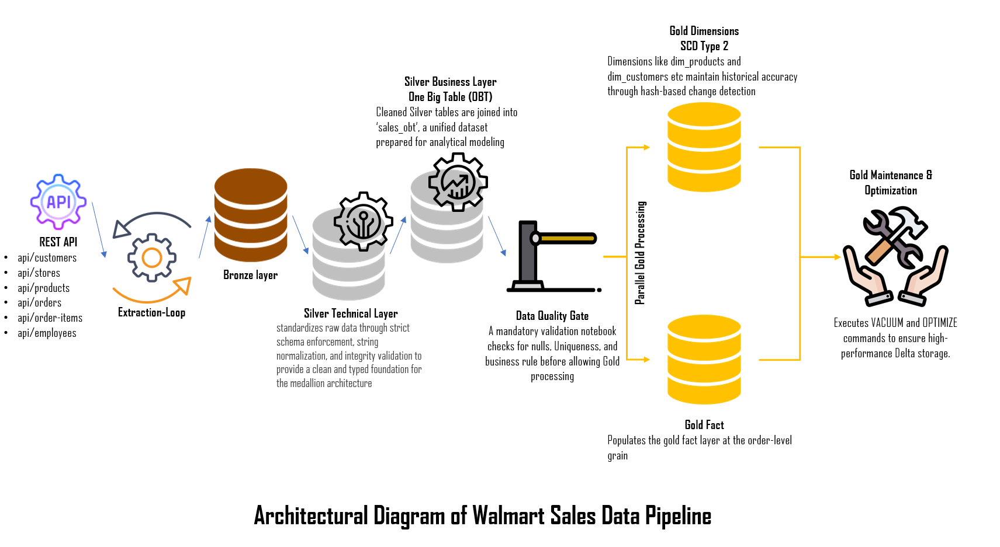

# Project Overview

## 1. Executive Summary

This project implements a Medallion Architecture data pipeline using Microsoft Fabric, Pyspark, and Delta Lake. This project purpose is to build a pipeline that transforms raw  sales dataset into business-ready Star Schema optimized for high-performance analytics.
This implementation includes metadata-driven engine for dynamic SQL generation, a robust Data Quality framework, and a "Circuit Breaker" pattern to ensure data integrity.

## 2. Business Objective

The goal of this project is to transform raw transactional sales data into an analytics-ready data platform that enables reliable reporting, historical analysis, and scalable business intelligence workloads.

## 3. Data Architecture (Medallion)

This project follows Medallion Archit (lakehouse architecture) to ensure traceability and reliability:

* **Bronze** (Raw): Ingests the source data from REST API into the Bronze layer as Delta tables. This project implements cursor-based Change Data Capture pattern, detecting incremental changes using updated\_timestamp columns to fetch only new or modified records since the last execution. This improves pipeline efficiency by processing only incremental changes through automated upserts using primary keys and maintain idempotency by preventing the inserting of duplicate records during repeated runs.
* **Silver** (Technical \& Business) :The silver layer is separated into two sub-layers.

  * **Technical Layer**: This layer is implemented using modular cleaning functions which handle whitespace trimming, type casting and primary key validation.
  * **Business Layer**: This layer is for building a "One Big Table" (OBT) model that combines related business entities before analytical modeling using a custom-built dynamic SQL generator based on metadata configurations, to ensure that pipline scales without code modifications as new tables are added.
* **Gold (Analytics):** Deconstructs the OBT into a star schema with facts and dimension tables.

  * SCD Type 2 logic: Implements manual Slowly Changing Dimensions (Type 2) using SHA-256 row hashing for change detection to track historical data accurately.

## 4. Engineering Design Principles

This project implements software engineering practices for extensibility, modularity and reliability to ensure the pipeline is dependable.

* **Metadata-Driven Design:** All complex transformations (OBT joins and Dimension table logic) are implemented using configuration lists, decoupling business logic from the execution engine. (Separation of concern and Declarative programming)
* **Dispatch Table pattern:** Creates dispatch tables for mapping the result of data quality tests to specific lambda functions, satisfying the Open-Closed Principle. (Behavioral Design Patterns and SOLID Principles)
* **Circuit Breaker Pattern:** The pipeline is designed to act as a data quality gatekeeper. If critical data quality standards are violated, the system triggers exception handling procedures programmatically that stop downstream star schema development. (Fault Tolerance and Fail-Fast Architecture)
* **Operational Excellence:** Includes an automated Maintenance task for gold layer that runs OPTIMIZE and VACUUM commands, to manage database storage and improve performance.

## 5. Technology Stack

* Storage & Engine: Delta Lake, Spark(PySpark), Microsoft Fabric
* Orchestration: Microsoft Fabric Pipelines
* Version Control: Git & GitHub
* Languages: Python (PySpark), SQL

## 6. Future Extensions

To demonstrate a long-term roadmap for production environments, the following features are planned:

* Automated Alerting: Integration with Office 365/Teams to send notifications on pipeline failure.
* Environment Parameterization: Implementing dynamic environment switching for CI/CD readiness.
* Semantic Layer Integration: Automating the refresh of Power BI Semantic Models upon successful Gold-layer completion.

Architectural Diagram

# Data Pipeline Workflow

## 1. Architecture Overview

The pipeline is orchestrated as a sequential workflow that transforms raw data into a clean, star schema model gold layer. It use PySpark and Delta Lake for scalable processing and ACID transactions.

### High-Level Flow:

1. Extraction Loop: Ingests raw data into the Bronze schema.
2. Silver Technical (silver_t): Standardizes and types the data.
3. Silver OBT (silver_b): Join silver tables into "One Big Table".
4. Data Quality Check: Validates data against business and technical rules.
5. Gold Processing: Simultaneously populates Dimensions (SCD Type 2) and Fact tables.
6. Maintenance: Optimizes Delta tables for performance and storage efficiency.

## 2. Pipeline Stages

### Stage 1: Bronze Ingestion (Extraction Loop)

* This stage uses a ForEach loop containing an Extraction_Loop activity
* It performs the Bronze_Extraction process, which pulls data from external sources (REST APIs) and save them as Delta tables in their raw, untransformed state under the bronze schema.
* This stage established a "Source of Truth". By landing data in Bronze layer first, this allow for re-producibility - if a transformation fails, it allow re-running the pipeline from the Bronze layer[...]

### Stage 2: Silver Technical Layer (silver_t)

This stage focus on Technical cleaning to ensure data consistency across the pipeline.

* **Schema Enforcement**: Converts string-based Bronze data into proper types: IntegerType, DecimalType(18,2), TimestampType, and BooleanType
* **Data Standardization**: Trims whitespace, lowercases email addresses, and normalizes "Y/N" flags to Booleans
* **Integrity**: Removes records with null or empty primary keys and performs initial de-duplication
* Output: Generates cleaned technical tables for each dataset.

### Stage 3: Silver OBT (One Big Table) Generation (silver_b)

This stage joins the relational normalized structure into a single wide table (sales_obt) to simplify Star schema modeling.

* **Dynamic Join Engine**: Uses metadata configs to programmatically build SQL joins query, using orders_t as the base table.
* **Conflict Resolution**: Automatically handles ambiguous column names (e.g., city, email) by applying prefixes like customer_ or store_ for their respective source .
* **Auditability**: Includes an **obt_processed_at** timestamp for every merged record

### Stage 4: Data Quality Validation

This stage acts as a 'gatekeeper'. It is designed to halt the entire pipeline if critical tests fail.

* **Technical Tests**: Checks the uniqueness of primary keys and null values across all silver tables.
* **Business Rules**: Validates domain-specific logic, such as ensuring product prices are non-negative and verifying email formats with Regex
* **Logging**: All results are written to a dq_test_results table to maintain a historical audit log of data validation

### Stage 5: Gold Layer - Dimensions (gold dim)

Implements Slowly Changing Dimensions (SCD Type 2) to track historical changes in dimensions table over time.

* Change Detection: Uses SHA-256 hashing on tracked attributes to identify changes between the source OBT and the target dimension.
* History Management: Add valid_from, valid_to, and is_current flags.
* Surrogate Keys: Generates and maintains unique surrogate keys for every dimension tables.

### Stage 5: Gold Layer - Fact (gold fact)

Build the central fact_orders table at the order-item grain.

Grain Preservation: Selects specific measures (quantity, line_amount) and natural keys from the OBT.

De-duplication: Ensures the fact table remains at the correct grain by removing any duplicate rows based on order_id and order_item_id.

## 3. Maintenance & Optimization

TO maintain long-term performance of the pipeline, a separate maintenance workflow is implemented.

* Compaction (Optimizes): merge small files into larger ones to improve read performance, with specific time period for each fact and dimension tables.
* Cleanup (Vacuum): Removes expire delta files that are no longer needed for time travel, using 7-day (168-hour) retention period
* Reporting: Logs maintenance duration and status for every table to a table_maintenance_log table.

# Data Quality Framework

## 1. Overview

The Data Quality Framework is a centralized, meta-driven validation engine designed to ensure data integrity as it moves from the Silver technical layer (silver\_t) to the Gold layer . It is design[..]

## 2. Core Validation Logic

This framework use a Dispatch pattern to map specific test types to modular Pyspark validation functions. This is meant for easy extensibility. New test case can be added by simply defining a new [...]

#### Supported test types:

* **not\_null**: Checks rows if critical columns (typically Primary Keys) contain NULL or empty string values.
* **unique**: Calculates the total number of records involved in a duplicate group, providing a direct count of records requiring investigation.
* **threshold**: Validates that numeric values satisfy specific mathematical operators (e.g., >=, <, >) against a defined threshold (e.g., ensuring product prices are never negative)
* **email\_format**: Uses a Regex pattern (**EMAIL\_REGEX**) to validate the structure of email addresses while intentionally ignoring NULLs (which are handled by the **not\_null** test)

## 3. Metadata-Drive Execution

The framework is configured using a metadata list (DQ\_TEST\_METADATA), which allow to  define test without writing new code for every table.

* **Generic Technical Tests**: Generate automatically for every table defined in the PRIMARY\_KEYS dictionary to ensure PKs are always unique and populated.

* **Business Rule Tests**: Defined specifically for domain logic, such as:

  * **product\_price\_non\_negative**: Ensures price >= 0 in the **products\_t** table

## 4. Operational Features

##### **Efficient Processing**

The framework minimizes compute costs by using a table cache during execution. Even if multiple tests are performed on the same table. the source data is only read once per session.

##### **Historical Auditing & Logging**

All test results—including table names, test names, failed record counts, and execution timestamps—are appended to a persistent Delta table: **silver.dq\_test\_results**.

##### **Pipeline "Circuit Breaker"**

The framework enforces a strict quality standard. If any test results in a FAIL status, the notebook raises an Exception, which stop the pipeline before it can insert data to the Gold layer.

# Maintenance Strategy

## 1. Objective

The goal of this maintenance strategy is to ensure the Gold Layer is in good performance and cost-effective. Over time, frequent updates (SCD type 2) and full-fact overwrite can lead to a "small file [...]

## 2. Core maintenance

This strategy use two primary delta lake commands to maintain table health:

- **OPTIMIZE:** This operation combine small files into larger, more efficient parquet files. This significantly improves read performance for downstream bi tools and analytical queries.
- **VACUUM:** This operation removes data files that are no longer in the latest state of the transaction log and are older than a defined retention period. This is essential for restoring storage spa[...]

## 3. Targeted Table Tiers

Maintenance is applied to all tables under the gold schema, separated by their updated frequency (Fact table is set as high-frequency and dim tables are set for weekly maintenance).

## 4. Configuration & Threshold

To balance performance with compute cost, the following thresholds are implemented:

- **Default retention**: 7 days retention period is set for Vacuum operations, which ensure that time-travel operations is only limited to one weak period and clean the older data.
- **Optimization Threshold**: The system is designed to trigger optimization once a table reaches a minimum file count of 500 which is meant to prevent unnecessary compute on already optimized small t[...]

## 5. Automated Monitoring and Auditing

The maintenance workflow is fully observable through centralized logging system.

- Log Table: All test results are inserted into table_maintenance_log table.
- Metrics Tracked: This table records the optimize_status, vacuum_status, and the duration (in seconds) for each operation for every table.
- Schema Evolution: The log table uses the **.option("mergeSchema", "true")** setting to ensure that if maintenance metrics are expanded in the future, the log remains stable

## 6. Error Handling & Workflow Integrity

The maintenance notebook acts as a "smart" process within the pipeline

- **Failure Detection**: The script calculates a failed_count at the end of every run. If any table fails one of its maintenance tasks, the process raises an Exception
- **Alerting**: This failure notification ensures that the data engineers are alerted to failure issues before these impact downstream query performance.

