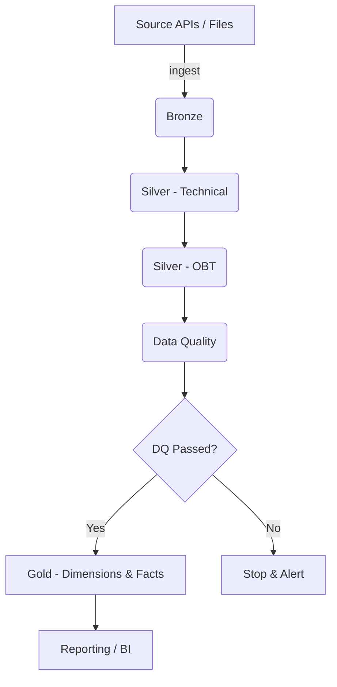

# Data Pipeline Workflow

> A concise, visual guide to the ETL workflow that converts raw source data into a clean star-schema Gold layer using PySpark + Delta Lake.

---

## Table of contents

1. [Architecture overview](#architecture-overview)
2. [High-level flow](#high-level-flow)
3. [Pipeline stages](#pipeline-stages)
   - Bronze
   - Silver (technical)
   - Silver OBT (One Big Table)
   - Data Quality Validation
   - Gold (Dimensions & Facts)
4. [Maintenance & optimization](#maintenance--optimization)
5. [Tips, examples & snippets](#tips-examples--snippets)

---

## Architecture overview

The pipeline is a sequential, metadata-driven ETL that moves data from raw sources into a star-schema Gold layer. It uses PySpark for scalable transformations and Delta Lake for ACID, time travel, and efficient compaction.

Key principles:
- Bronze = source-of-truth (raw, immutable)
- Silver = cleaned, typed, and joined (technical + OBT)
- Gold = SCD-managed dimensions and grain-correct fact tables
- Metadata-driven joins & tests for repeatability and auditability




---

## High-level flow

1. Extraction Loop: ingest raw source payloads into Bronze (Delta) tables.
2. Silver Technical (silver_t): apply schema enforcement, type conversions, and canonicalization.
3. Silver OBT (silver_b): programmatic joins into a One Big Table to simplify downstream modeling.
4. Data Quality Check: run technical + business tests; fail-fast on critical issues.
5. Gold Processing: populate SCD Type 2 dimensions and order-level fact tables.
6. Maintenance: optimize (compaction) and vacuum stale files.

---

## Pipeline stages

### Stage 1 — Bronze ingestion

- Purpose: capture raw events/payloads unchanged. Store as Delta in `bronze.*`.
- Characteristics: immutable, append-only, timestamped landing area.
- Notes: include source metadata (raw_filename, source_received_at, ingestion_id) to enable reproducibility.

**Inputs:** external REST APIs / files
**Outputs:** bronze.<table> (Delta)

---

### Stage 2 — Silver (Technical) - `silver_t`

Purpose: schema enforcement and deterministic cleaning.

Key steps:
- Schema enforcement: convert strings -> IntegerType, DecimalType(18,2), TimestampType, BooleanType
- Standardization: trim strings, lower-case emails, normalize flags (Y/N -> boolean)
- Integrity & de-dupe: remove records with empty PKs, basic dedup by natural key + latest timestamp

**Outputs:** silver_t.<table>

---

### Stage 3 — Silver OBT (One Big Table) - `silver_b`

Purpose: create a wide, denormalized table (e.g., `sales_obt`) to simplify Gold modeling.

Features:
- Dynamic join engine driven by metadata configs (joins, prefixes, join types)
- Conflict resolution: apply source prefixes (customer_, store_) for ambiguous fields
- Audit fields: `obt_processed_at`, `obt_source_version` and `obt_run_id`

**Outputs:** silver_b.sales_obt (Delta)

---

### Stage 4 — Data Quality Validation

Purpose: gatekeeper that validates both technical and business expectations before Gold writes.

- Technical tests: uniqueness, not-null PKs, row counts
- Business rules: non-negative amounts, valid email formats, domain constraints
- Results logged to `silver.dq_test_results` with test_name, table_name, status, failed_count, details, executed_at

If any critical test fails, the pipeline raises an exception and halts (circuit-breaker).

---

### Stage 5 — Gold layer

Gold Dimensions (SCD Type 2)
- Detect changes using attribute hashing (SHA-256), maintain `valid_from`, `valid_to`, `is_current`
- Generate surrogate keys and preserve slowly changing history

Gold Facts
- Build fact tables at the required grain (e.g., `fact_orders` at order-item)
- Preserve measures (quantity, line_amount), natural keys, and ensure no duplicates (uniqueness on order_id + order_item_id)


---

## Maintenance & optimization

- Compaction (OPTIMIZE): consolidate small files periodically per table (schedules by table type)
- Vacuum: remove old delta files (retention e.g. 7 days / 168 hours) after ensuring no required time-travel
- Maintenance logs: record table, operation, start/end, duration and status to `table_maintenance_log`

---

## Tips, examples & snippets

Example PySpark pattern: read Bronze once, reuse for multiple transformations:

```python
# pseudocode
bronze_df = spark.read.format('delta').load(bronze_path)
clean_df = bronze_df
  .withColumn('amount', bronze_df['amount'].cast('decimal(18,2)'))
  .withColumn('email', lower(trim(col('email'))))

# write to silver
clean_df.write.format('delta').mode('overwrite').save(silver_path)
```

Example recommended metadata keys for dynamic joins (JSON):

```json
{
  "base_table": "orders_t",
  "joins": [
    {"table": "customers_t", "on": "orders_t.customer_id = customers_t.customer_id", "prefix": "customer_"},
    {"table": "stores_t", "on": "orders_t.store_id = stores_t.store_id", "prefix": "store_"}
  ]
}
```

---

If you'd like, I can also:
- add diagrams as PNG/SVG to the docs folder and embed them
- generate a single canonical filename and remove duplicates

